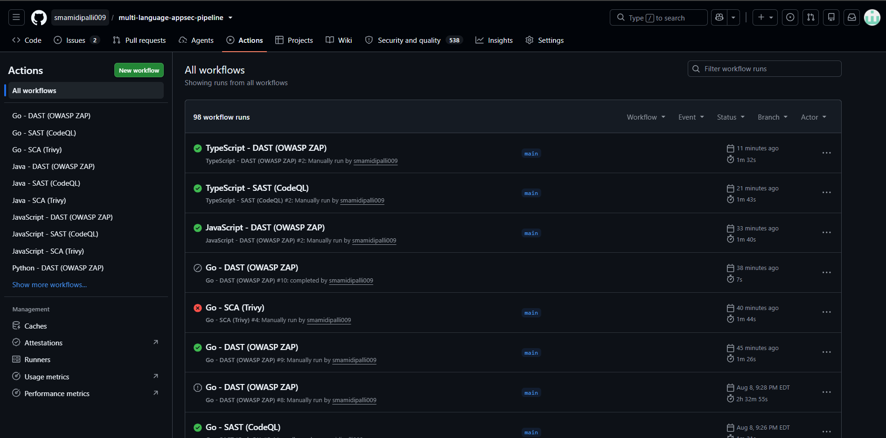
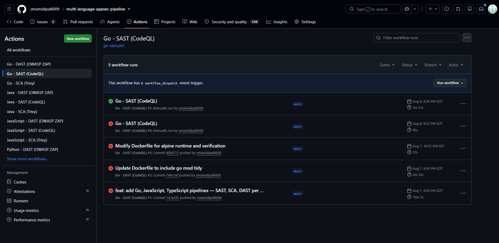
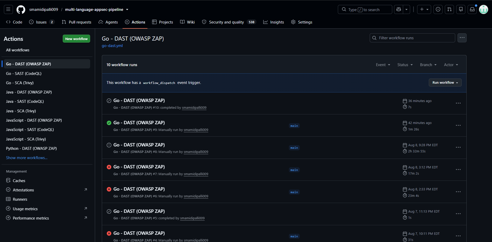
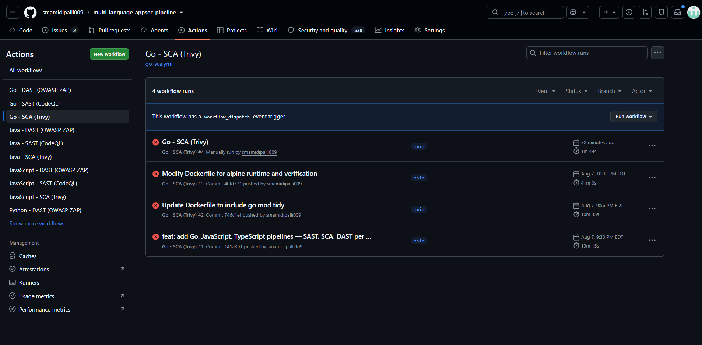
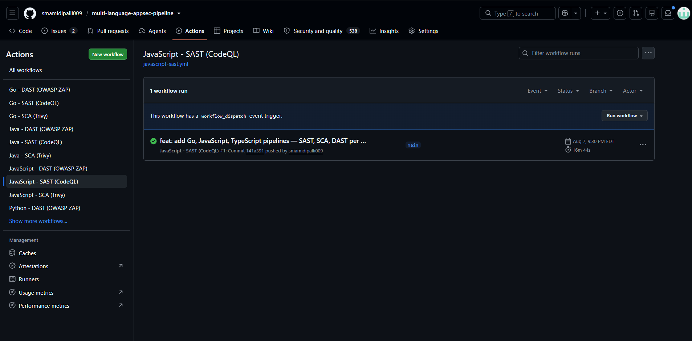
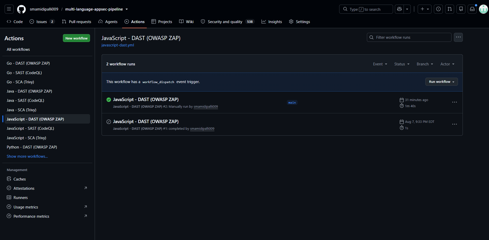
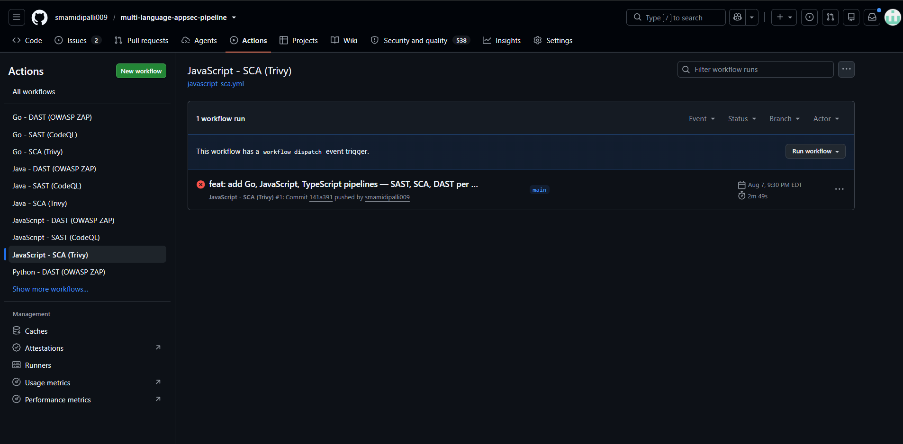
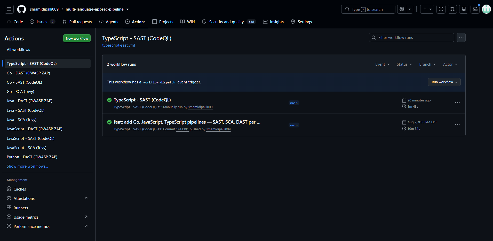
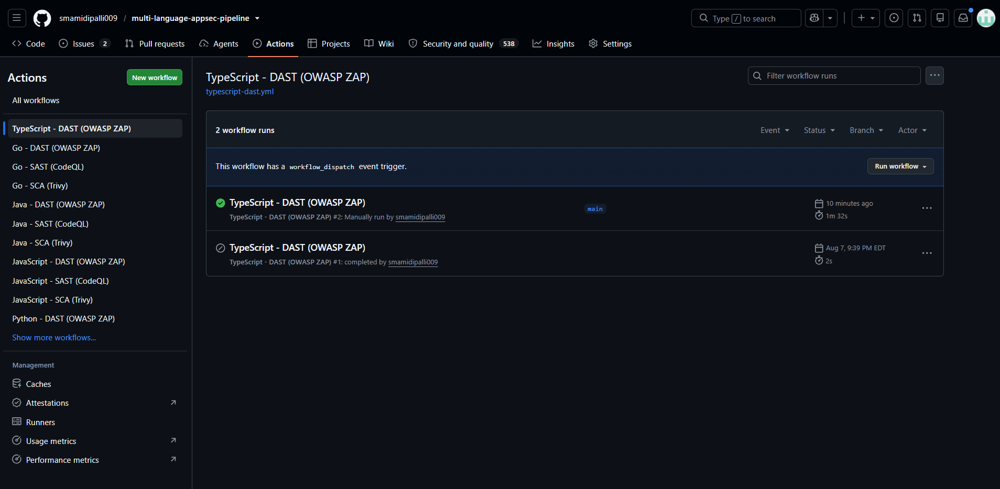

# Multi-Language AppSec Pipeline


An end-to-end application security pipeline covering all three core testing
layers — **SAST**, **SCA**, and **DAST** — across 5 languages, with separate
independently triggerable workflow files per language per layer.

---

## Pipeline overview

```
Code push
    │
    ├── SAST (CodeQL)    → scans source code for vulnerabilities
    │                      Interpreted: Python, JavaScript, TypeScript — no build needed
    │                      Compiled: Java (mvn), Go (go build) — build step required
    │
    ├── SCA  (Trivy)     → builds Docker image, scans for CVEs in OS + deps
    │                      Gates build on HIGH/CRITICAL fixable vulns
    │                      Generates SBOM (CycloneDX), pushes to GHCR if clean
    │
    └── DAST (OWASP ZAP) → spins up container → ZAP baseline scans live app
                           Finds runtime issues: missing security headers,
                           exposed endpoints, misconfigured CORS
                           Results uploaded to Security tab as SARIF
```

---

## Current status

| Language | SAST | SCA | DAST | Docker base | Framework | Port |
|---|---|---|---|---|---|---|
| **Python** | ✅ | ✅ | ✅ | Distroless Python3 | Flask | 5001 |
| **Java** | ✅ | ✅ | ✅ | Distroless Java17 | Spring Boot | 8081 |
| **Go** | ✅ | ✅ | ✅ | Alpine 3.19 | net/http | 9001 |
| **JavaScript** | ✅ | ✅ | ✅ | Distroless Node20 | Express.js | 9002 |
| **TypeScript** | ✅ | ✅ | ✅ | Distroless Node20 | Express.js | 9003 |

**98 total workflow runs** — **538 code scanning alerts** across all languages

---

## Project structure

```
.
├── src/
│   ├── python/
│   │   ├── app.py              # vulnerable (5 CVEs)
│   │   ├── app_fixed.py        # hardened
│   │   ├── requirements.txt
│   │   └── Dockerfile
│   ├── java/
│   │   ├── src/main/java/com/devsecops/
│   │   │   ├── App.java        # vulnerable (6 CVEs)
│   │   │   └── AppFixed.java   # hardened
│   │   ├── pom.xml
│   │   └── Dockerfile
│   ├── go/
│   │   ├── main.go             # vulnerable (5 CVEs, //go:build ignore)
│   │   ├── main_fixed.go       # hardened
│   │   ├── go.mod
│   │   └── Dockerfile
│   ├── javascript/
│   │   ├── app.js              # vulnerable (6 CVEs)
│   │   ├── app_fixed.js        # hardened
│   │   ├── package.json
│   │   └── Dockerfile
│   └── typescript/
│       ├── src/app.ts          # vulnerable (6 CVEs)
│       ├── src/app_fixed.ts    # hardened
│       ├── package.json
│       ├── tsconfig.json
│       └── Dockerfile
│
├── scripts/
│   └── zap_to_sarif.py         # converts ZAP JSON → SARIF for Security tab
│
├── .zap/
│   └── rules.tsv               # ZAP false-positive suppression rules
│
├── .github/workflows/
│   ├── python-sast.yml
│   ├── python-sca.yml
│   ├── python-dast.yml
│   ├── java-sast.yml
│   ├── java-sca.yml
│   ├── java-dast.yml
│   ├── go-sast.yml
│   ├── go-sca.yml
│   ├── go-dast.yml
│   ├── javascript-sast.yml
│   ├── javascript-sca.yml
│   ├── javascript-dast.yml
│   ├── typescript-sast.yml
│   ├── typescript-sca.yml
│   └── typescript-dast.yml
│
└── docs/screenshots/
```

---

## Vulnerabilities per language (before/after)

### Python — 5 vulnerabilities

| # | Vulnerability | CodeQL Rule | Fix |
|---|---|---|---|
| 1 | SQL Injection | `py/sql-injection` | Parameterised query |
| 2 | Command Injection | `py/command-injection` | `subprocess` list args |
| 3 | Path Traversal | `py/path-injection` | `os.path.basename()` + safe dir |
| 4 | Hardcoded Credentials | `py/hardcoded-credentials` | Environment variables |
| 5 | Flask Debug Mode | `py/flask-debug` | `debug` from env var |

### Java — 6 vulnerabilities

| # | Vulnerability | CodeQL Rule | Fix |
|---|---|---|---|
| 1 | SQL Injection | `java/sql-injection` | `PreparedStatement` |
| 2 | Command Injection | `java/command-line-injection` | `ProcessBuilder` list args |
| 3 | Path Traversal | `java/path-injection` | `Path.normalize()` + safe dir |
| 4 | Hardcoded Credentials | `java/hardcoded-password-field` | Environment variables |
| 5 | XXE | `java/xxe` | Disable DOCTYPE + external entities |
| 6 | SSRF | `java/ssrf` | Host allowlist |

### Go — 5 vulnerabilities

| # | Vulnerability | CodeQL Rule | Fix |
|---|---|---|---|
| 1 | SQL Injection | `go/sql-injection` | Parameterised query |
| 2 | Command Injection | `go/command-injection` | `exec.Command` list args |
| 3 | Path Traversal | `go/path-injection` | `filepath.Base()` + safe dir |
| 4 | Hardcoded Credentials | `go/hardcoded-credentials` | `os.Getenv()` |
| 5 | SSRF | `go/ssrf` | Host allowlist |

### JavaScript — 6 vulnerabilities

| # | Vulnerability | CodeQL Rule | Fix |
|---|---|---|---|
| 1 | SQL Injection | `js/sql-injection` | Parameterised query |
| 2 | Command Injection | `js/command-line-injection` | `execFile` list args |
| 3 | Path Traversal | `js/path-injection` | `path.basename()` + safe dir |
| 4 | Hardcoded Credentials | `js/hardcoded-credentials` | `process.env` |
| 5 | Prototype Pollution | `js/prototype-pollution` | `Object.hasOwn()` check |
| 6 | ReDoS | `js/redos` | Safe non-backtracking regex |

### TypeScript — 6 vulnerabilities

| # | Vulnerability | CodeQL Rule | Fix |
|---|---|---|---|
| 1 | SQL Injection | `js/sql-injection` | Parameterised query |
| 2 | Command Injection | `js/command-line-injection` | `execFile` list args |
| 3 | Path Traversal | `js/path-injection` | `path.basename()` + safe dir |
| 4 | Hardcoded Credentials | `js/hardcoded-credentials` | `process.env` |
| 5 | Unsafe Deserialization | `js/unsafe-deserialization` | Schema validation |
| 6 | Type Assertion Abuse | Type guard | Proper type guard |

---

## Workflow files (15 total)

| File | Layer | Language | Build step | Fails build? |
|---|---|---|---|---|
| `python-sast.yml` | SAST | Python | None | No |
| `python-sca.yml` | SCA | Python | Docker | Yes — HIGH/CRITICAL |
| `python-dast.yml` | DAST | Python | Docker | No |
| `java-sast.yml` | SAST | Java | `mvn compile` | No |
| `java-sca.yml` | SCA | Java | Docker + Maven | Yes — HIGH/CRITICAL |
| `java-dast.yml` | DAST | Java | Docker + Maven | No |
| `go-sast.yml` | SAST | Go | `go build` | No |
| `go-sca.yml` | SCA | Go | Docker | Yes — HIGH/CRITICAL |
| `go-dast.yml` | DAST | Go | Docker | No |
| `javascript-sast.yml` | SAST | JavaScript | None | No |
| `javascript-sca.yml` | SCA | JavaScript | Docker | Yes — HIGH/CRITICAL |
| `javascript-dast.yml` | DAST | JavaScript | Docker | No |
| `typescript-sast.yml` | SAST | TypeScript | None (CodeQL handles TS) | No |
| `typescript-sca.yml` | SCA | TypeScript | Docker + tsc | Yes — HIGH/CRITICAL |
| `typescript-dast.yml` | DAST | TypeScript | Docker + tsc | No |

---

## Real findings (538 total code scanning alerts)

### Python — CodeQL SAST (19 alerts)

| Severity | Finding | File |
|---|---|---|
| Critical | Uncontrolled command line | `app.py:62` |
| High | Reflected XSS | `app.py:63` |
| High | SQL query from user input | `app.py:48` |
| High | Uncontrolled path expression | `app.py:76` |
| High | Flask debug mode | `app.py:87` |

### Python — OWASP ZAP DAST

| Severity | Finding |
|---|---|
| Warning | CSP Header Not Set |
| Warning | Server Leaks Version |
| Warning | Storable and Cacheable Content |
| Warning | Permissions Policy Not Set |

### Java — CodeQL SAST (7 open, 7 closed)

| Severity | Finding | File |
|---|---|---|
| Critical | Server-side request forgery | `AppFixed.java:102` |
| Critical | Uncontrolled command line | `AppFixed.java:62` |
| Critical | Command line string concatenation | `App.java:43` |
| High | Cross-site scripting | `AppFixed.java:105` |
| High | Query from untrusted string | `App.java:35` |

### Java — Trivy SCA (Critical CVEs)

| Library | CVE type |
|---|---|
| `tomcat-embed-core-10.1.2` | RCE, auth bypass, HTTP/2 injection |
| `tomcat-coyote` | Authorization bypass, digest auth bypass |
| `zlib` | Integer overflow (heap buffer overflow) |

---

## Security tab categories

| Category | Tool | Language |
|---|---|---|
| `sast-python` | CodeQL | Python |
| `sca-python` | Trivy | Python |
| `dast-python` | OWASP ZAP | Python |
| `sast-java` | CodeQL | Java |
| `sca-java` | Trivy | Java |
| `dast-java` | OWASP ZAP | Java |
| `sast-go` | CodeQL | Go |
| `sca-go` | Trivy | Go |
| `dast-go` | OWASP ZAP | Go |
| `sast-javascript` | CodeQL | JavaScript |
| `sca-javascript` | Trivy | JavaScript |
| `dast-javascript` | OWASP ZAP | JavaScript |
| `sast-typescript` | CodeQL | TypeScript |
| `sca-typescript` | Trivy | TypeScript |
| `dast-typescript` | OWASP ZAP | TypeScript |

---

## Setup

```bash
git clone https://github.com/smamidipalli009/multi-language-appsec-pipeline.git
cd multi-language-appsec-pipeline
```

Workflows trigger automatically on push to `main`.
For manual runs: **Actions tab → select workflow → Run workflow**

### Runner requirements

```
self-hosted, Linux, X64, secops_machine
```

Dependencies: Docker, Git, curl, Python 3, Java 17 + Maven, Go 1.21

---

## Screenshots

### All workflow runs (98 runs, 15 workflows)


### Go SAST — CodeQL


### Go DAST — OWASP ZAP


### Go SCA — Trivy


### JavaScript SAST — CodeQL


### JavaScript DAST — OWASP ZAP


### JavaScript SCA — Trivy


### TypeScript SAST — CodeQL


### TypeScript DAST — OWASP ZAP


### Code scanning — all alerts


### Code scanning — Python findings


### Code scanning — Java findings


---

> Add new screenshots to `docs/screenshots/` and commit:
> `git add docs/screenshots/ && git commit -m "docs: add screenshots"`
